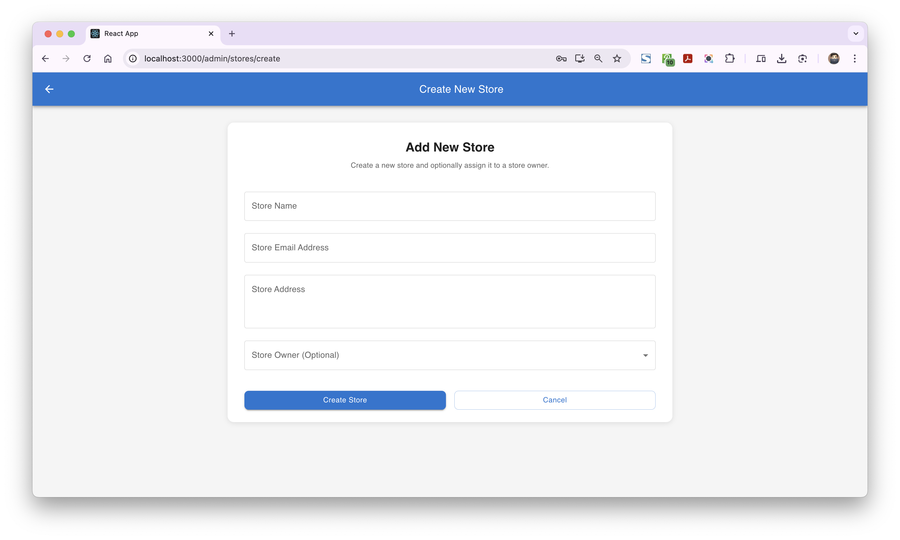
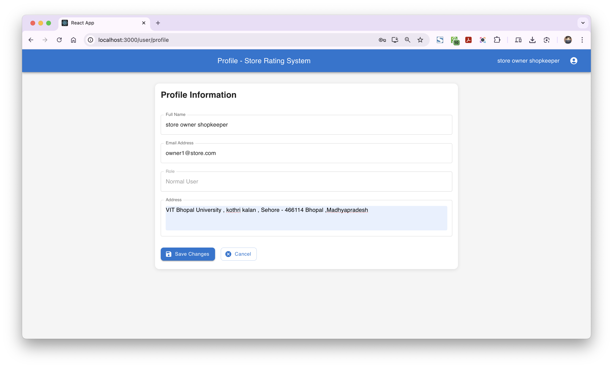
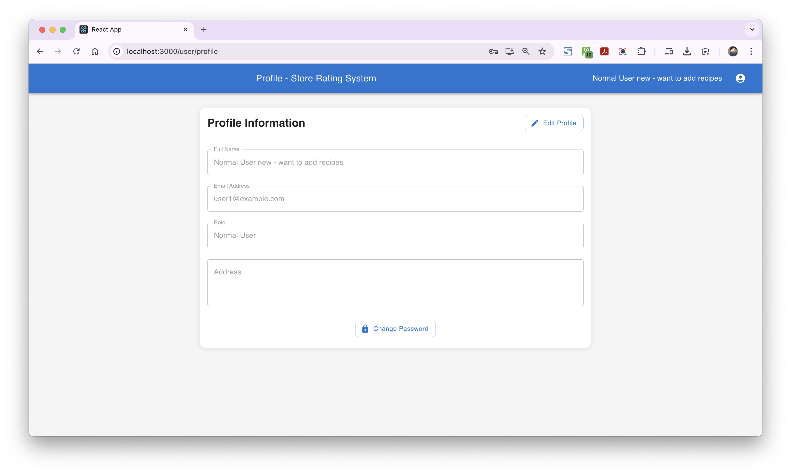

# Store Rating System - Full Stack Web Application

A comprehensive store rating and management system built with React (TypeScript) frontend and Node.js/Express backend with PostgreSQL database.

## 📸 Application Screenshots

### Login Page


### Registration Page


### Admin Dashboard


### User Management


### Create New User


### Create New Store


### Store Owner Profile


### Normal User Profile


### My Rating


## 🚀 Project Overview

This application allows users to rate and review stores, while providing administrators with powerful management capabilities. The system supports role-based access control with different user types and comprehensive store management features.

### Key Features

- **User Authentication & Authorization**: JWT-based authentication with role-based access control
- **Store Management**: CRUD operations for stores with owner assignment
- **Rating System**: Users can rate and review stores
- **Admin Dashboard**: Comprehensive admin panel with statistics and management tools
- **Responsive UI**: Modern Material-UI based interface
- **Security**: Rate limiting, CORS protection, and input validation

## 🏗️ Architecture

### Frontend (React + TypeScript)
- **Framework**: React 18 with TypeScript
- **UI Library**: Material-UI (MUI)
- **State Management**: React Context API
- **HTTP Client**: Axios
- **Form Handling**: React Hook Form with Yup validation
- **Routing**: React Router DOM

### Backend (Node.js + Express)
- **Runtime**: Node.js
- **Framework**: Express.js
- **Database**: PostgreSQL
- **Authentication**: JWT (JSON Web Tokens)
- **Security**: Helmet, CORS, Rate Limiting
- **Password Hashing**: bcryptjs
- **Environment**: dotenv

## 📁 Project Structure

```
Roxiler-system-Fullstack-web-app/
├── client/                     # React frontend
│   ├── public/                # Static assets
│   ├── src/
│   │   ├── components/        # Reusable React components
│   │   ├── contexts/          # React Context providers
│   │   │   └── AuthContext.tsx # Authentication context
│   │   ├── pages/             # Page components
│   │   │   ├── Login.tsx      # Login page
│   │   │   ├── Dashboard.tsx  # User dashboard
│   │   │   ├── StoreManagement.tsx # Admin store management
│   │   │   └── UserManagement.tsx  # Admin user management
│   │   ├── App.tsx            # Main app component
│   │   └── index.tsx          # App entry point
│   ├── package.json           # Frontend dependencies
│   └── .env                   # Frontend environment variables
├── routes/                    # Backend API routes
│   ├── auth.js               # Authentication routes
│   ├── users.js              # User management routes
│   ├── stores.js             # Store management routes
│   ├── ratings.js            # Rating system routes
│   └── admin.js              # Admin-specific routes
├── middleware/               # Express middleware
│   ├── auth.js              # JWT authentication middleware
│   └── validation.js        # Input validation middleware
├── config/
│   └── database.js          # PostgreSQL connection configuration
├── scripts/
│   └── init-db.js           # Database initialization script
├── server.js                # Express server entry point
├── package.json             # Backend dependencies
└── .env                     # Backend environment variables
```

## 🛠️ Setup Instructions

### Prerequisites

- Node.js (v16 or higher)
- PostgreSQL (v12 or higher)
- npm or yarn package manager

### 1. Clone the Repository

```bash
git clone <repository-url>
cd Roxiler-system-Fullstack-web-app
```

### 2. Database Setup

1. Install PostgreSQL and create a database:
```sql
CREATE DATABASE store_rating_db;
```

2. Update the backend `.env` file with your database credentials:
```env
DB_HOST=localhost
DB_PORT=5432
DB_NAME=store_rating_db
DB_USER=your_username
DB_PASSWORD=your_password
```

### 3. Backend Setup

1. Install dependencies:
```bash
npm install
```

2. Configure environment variables in `.env`:
```env
# Database Configuration
DB_HOST=localhost
DB_PORT=5432
DB_NAME=store_rating_db
DB_USER=your_username
DB_PASSWORD=your_password

# JWT Configuration
JWT_SECRET=your_super_secret_jwt_key_here_change_in_production
JWT_EXPIRE=7d

# Server Configuration
PORT=5001
NODE_ENV=development
CLIENT_URL=http://localhost:3000

# Admin Default Credentials
ADMIN_EMAIL=admin@storerating.com
ADMIN_PASSWORD=Admin@123
ADMIN_NAME=System Administrator
```

3. Initialize the database:
```bash
node scripts/init-db.js
```

4. Start the backend server:
```bash
npm start
```

The backend will run on `http://localhost:5001`

### 4. Frontend Setup

1. Navigate to the client directory:
```bash
cd client
```

2. Install dependencies:
```bash
npm install
```

3. Configure environment variables in `client/.env`:
```env
REACT_APP_API_URL=http://localhost:5001/api
```

4. Start the frontend development server:
```bash
npm start
```

The frontend will run on `http://localhost:3000`

## 🔐 Default Login Credentials

**System Administrator:**
- Email: `admin@storerating.com`
- Password: `Admin@123`

**Additional Test Users:**
- Email: `admin@system.com`
- Password: `Admin@123`

## 🗄️ Database Schema

### Users Table
- `id` (Primary Key)
- `name` (VARCHAR)
- `email` (VARCHAR, Unique)
- `password` (VARCHAR, Hashed)
- `address` (TEXT)
- `role` (ENUM: 'NORMAL_USER', 'SYSTEM_ADMIN')
- `created_at` (TIMESTAMP)
- `updated_at` (TIMESTAMP)

### Stores Table
- `id` (Primary Key)
- `name` (VARCHAR)
- `email` (VARCHAR)
- `address` (TEXT)
- `owner_id` (Foreign Key → users.id)
- `average_rating` (DECIMAL)
- `total_ratings` (INTEGER)
- `created_at` (TIMESTAMP)
- `updated_at` (TIMESTAMP)

### Ratings Table
- `id` (Primary Key)
- `user_id` (Foreign Key → users.id)
- `store_id` (Foreign Key → stores.id)
- `rating` (INTEGER, 1-5)
- `review` (TEXT)
- `created_at` (TIMESTAMP)
- `updated_at` (TIMESTAMP)

## 🔌 API Endpoints

### Authentication Routes (`/api/auth`)
- `POST /login` - User login
- `POST /register` - User registration
- `GET /verify-token` - Token verification
- `POST /logout` - User logout

### User Routes (`/api/users`)
- `GET /profile` - Get user profile
- `PUT /profile` - Update user profile
- `GET /` - Get all users (Admin only)
- `DELETE /:id` - Delete user (Admin only)

### Store Routes (`/api/stores`)
- `GET /` - Get all stores with pagination
- `POST /` - Create new store (Admin only)
- `PUT /:id` - Update store (Admin only)
- `DELETE /:id` - Delete store (Admin only)
- `GET /:id` - Get store details

### Rating Routes (`/api/ratings`)
- `POST /` - Submit rating
- `GET /store/:storeId` - Get store ratings
- `GET /user/:userId` - Get user ratings

### Admin Routes (`/api/admin`)
- `GET /dashboard` - Dashboard statistics
- `GET /stores` - Store management with filters
- `GET /users` - User management
- `GET /recent-users` - Recent user registrations
- `GET /recent-stores` - Recent store additions

## 🛡️ Security Features

- **JWT Authentication**: Secure token-based authentication
- **Password Hashing**: bcrypt with salt rounds
- **Rate Limiting**: 1000 requests per 15 minutes per IP
- **CORS Protection**: Configured for frontend origin
- **Helmet Security**: Security headers
- **Input Validation**: Server-side validation for all inputs
- **Role-Based Access**: Different permissions for users and admins

## 🎨 Frontend Features

### User Interface
- **Responsive Design**: Works on desktop and mobile
- **Material-UI Components**: Modern, accessible UI components
- **Dark/Light Theme**: Consistent theming
- **Form Validation**: Real-time validation with error messages
- **Loading States**: User feedback during API calls

### User Management
- **Authentication Context**: Global auth state management
- **Protected Routes**: Route guards based on authentication
- **Role-Based Navigation**: Different menus for different user types
- **Profile Management**: Users can update their profiles

### Store Management (Admin)
- **CRUD Operations**: Create, read, update, delete stores
- **Pagination**: Handle large datasets efficiently
- **Search & Filter**: Find stores by various criteria
- **Owner Assignment**: Assign stores to users
- **Bulk Operations**: Manage multiple stores

## 🚀 Development Guidelines

### Code Style
- **TypeScript**: Strict typing for better code quality
- **ESLint**: Code linting for consistency
- **Prettier**: Code formatting
- **Component Structure**: Functional components with hooks

### Best Practices
- **Error Handling**: Comprehensive error handling on both frontend and backend
- **Environment Variables**: Sensitive data in environment files
- **API Response Format**: Consistent JSON response structure
- **Database Transactions**: Ensure data consistency
- **Input Sanitization**: Prevent SQL injection and XSS attacks

## 🐛 Troubleshooting

### Common Issues

1. **Login Failed Error**:
   - Check if backend server is running on port 5001
   - Verify database connection
   - Use correct credentials: `admin@storerating.com` / `Admin@123`
   - Check rate limiting (max 1000 requests per 15 minutes)

2. **Database Connection Issues**:
   - Verify PostgreSQL is running
   - Check database credentials in `.env`
   - Ensure database exists
   - Run `node scripts/init-db.js` to initialize

3. **CORS Errors**:
   - Verify `CLIENT_URL` in backend `.env`
   - Check `REACT_APP_API_URL` in frontend `.env`

4. **Store Management Errors**:
   - Ensure user has admin role
   - Check API endpoint responses
   - Verify database schema is up to date

### Development Commands

```bash
# Backend
npm start                 # Start server
npm run dev              # Start with nodemon (if configured)
node scripts/init-db.js  # Initialize database

# Frontend
npm start                # Start development server
npm run build           # Build for production
npm test                # Run tests
```

## 📝 Future Enhancements

- **Image Upload**: Store logos and user avatars
- **Email Notifications**: Email confirmations and notifications
- **Advanced Analytics**: Detailed reporting and analytics
- **Mobile App**: React Native mobile application
- **Real-time Updates**: WebSocket integration
- **Payment Integration**: Premium store features
- **Social Features**: User following and social ratings
- **API Documentation**: Swagger/OpenAPI documentation

## 🤝 Contributing

1. Fork the repository
2. Create a feature branch (`git checkout -b feature/amazing-feature`)
3. Commit your changes (`git commit -m 'Add some amazing feature'`)
4. Push to the branch (`git push origin feature/amazing-feature`)
5. Open a Pull Request

## 📄 License

This project is licensed under the MIT License - see the LICENSE file for details.

## 👥 Support

For support and questions:
- Create an issue in the repository
- Check the troubleshooting section
- Review the API documentation

---

**Note**: This is a development setup. For production deployment, ensure to:
- Use strong JWT secrets
- Configure proper CORS origins
- Set up SSL/HTTPS
- Use environment-specific configurations
- Implement proper logging and monitoring
- Set up database backups
- Configure proper rate limiting for production load